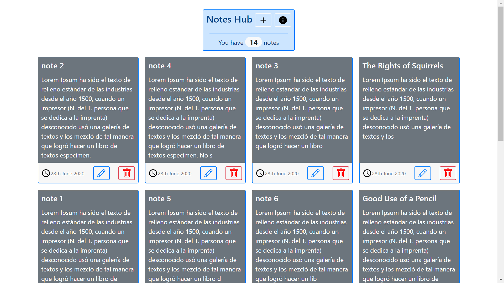
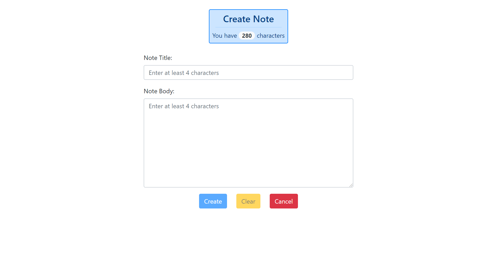
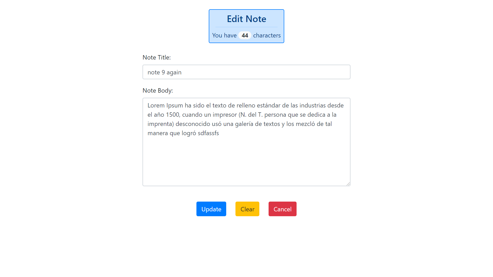

# NotesHub

* Displays simple text notes in a grid of Bootstrap cards.
* Uses the MongoDB, Express, Vue & Node.js (MEVN) stack to perform Create, Read, Update and Delete (CRUD) operations.
* **Note:** to open web links in a new window use: _ctrl+click on link_

## General info

* Axios used to send/receive data from the MongoDB backend
* A responsive grid of notes is displayed on the Vue frontend using data-binding and a v-for loop. Once a note is added then the grid of notes is reloaded.
* There is an app info. page
* Backend node.js code separated into routes/controller files with a Mongoose model Note schema.
* Latest Mongoose v6 connection config. used with no deprecation warnings. Note an old config. will stop any Mongoose-based app from working.

## Screenshots

## Technologies

### Frontend

* [Vue framework v3](https://vuejs.org/)
* [Axios v0.21.1](https://github.com/axios/axios), a promise-based http client, used to consume API data.
* [vue-axios v3](https://www.npmjs.com/package/vue-axios) for integrating axios to Vuejs
* [Vue DevTools extension for Chrome](https://chrome.google.com/webstore/detail/vuejs-devtools/nhdogjmejiglipccpnnnanhbledajbpd)
* [Bootstrap v4](https://getbootstrap.com/) components and styles
* [Vue moment v4](https://github.com/brockpetrie/vue-moment#readme) to convert UTC date format
* [Material svg icons](https://material.io/resources/icons/?search=cale&icon=event_note&style=baseline)

### Backend

* [Express v4](https://expressjs.com/)
* [Mongoose v6](https://mongoosejs.com/)
* [cors v2](https://www.npmjs.com/package/cors) Cross Origin Resource Sharing Connect/Express middleware
* [Node v14](https://nodejs.org/en/) JavaScript runtime built on Chrome's V8 JavaScript engine.

## Features

* In dev - Front and backends are run with one command using concurrently set up in package.json
* Display of card array is responsive so they wrap around nicely as screen size changes
* Simple 'Notes Hub' tells user how many notes there are and lets them navigate to the add note or app info pages
* note max title length set to 23 so it shows on 1 line in card
* note max content length set to 280, same as a twitter post
* backend code separates controller functions from routes
* Updating a note will automatically update the date so it goes to the front of the (date-sorted) notes list
